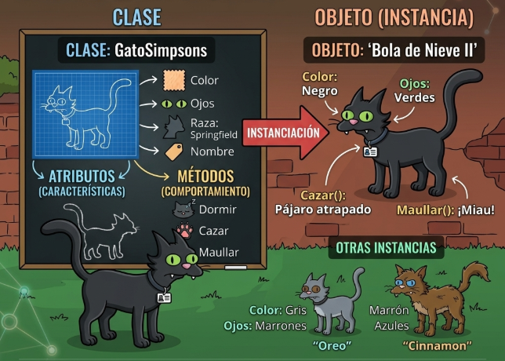

## Programación Orientada a Objetos (POO)

Es un paradigma de programación que organiza el código estructurando las funciones y los datos en entidades llamadas objetos. Nos permite modelar problemas del mundo real mediante código limpio, ordenado y reutilizable.

## Como se crea una clase

Es un molde para crear diversos objetos únicos de la vida real, a este proceso se le llama instanciación.

Composición:

- Características que vienen a ser los atributos.
- El comportamiento es el métodos

Vale te explico lo que pasa al crear la variable de `mi_carro`, primero se almacena en memoria y crea la referencia. Python llama al método `__init__` de la clase para inicializar el objeto. Ese `selft` que vez en la imagen almacena la referencia de mi variable `mi_carro`.

## Atributo de clase y Instancia

- Atributo de Instancia (self.atributo): Se define dentro del **init**. Cada objeto tiene su propio valor independiente (ej. la marca o el color del carro).
  - Se utiliza cuando quiero datos del objeto.
- Atributo de Clase: Se define directamente bajo la clase. Todos los objetos comparten exactamente el mismo valor (ej. todos los carros tienen 4 ruedas).

## Métodos

En Python, todos los métodos de una instancia deben recibir self como su primer parámetro.

- Si quieres que el método imprima el nombre del coche, necesita self para ir a buscar ese dato permanente en la memoria RAM que vimos antes.

## 4 pilares de POO

### Encapsulamiento

Encapsulamiento es proteger el estado interno y poner reglas para acceder o modificarlo el objeto.

#### Niveles de visibilidad

Python no tiene `public`, `private` ni `protected` como Java o C++. En su lugar usa convenciones con guiones bajos:

| Nivel     | Sintaxis   | ¿Qué significa?                    |
| --------- | ---------- | ---------------------------------- |
| Público   | `nombre`   | Cualquiera puede acceder           |
| Protegido | `_nombre`  | Convención: "no tocar desde fuera" |
| Privado   | `__nombre` | Python aplica _name mangling_      |

> **¿Qué es el name mangling?**
> Cuando escribes `__password` dentro de la clase `Usuario`, Python la renombra internamente a `_Usuario__password`. Así evita colisiones en herencia, pero **no es seguridad real**, sigues pudiendo acceder si sabes el nombre.

El encapsulamiento cobra sentido cuando controlas el acceso a los atributos privados. En Python se hace con decoradores, no con métodos `get_x()` / `set_x()`.

### Abstracción

- Abstracción: Mostrar solo lo necesario y ocultar la complejidad de cómo funciona por dentro. En este caso, sabemos que toda cuenta debe poder calcular el interés, pero no necesitamos saber cómo lo calcula cada tipo de cuenta

- Clases abstractas: Una clase abstracta permite convertir esa idea en un contrato para las clases hijas. `@abstractmethod` indica qué método las clases hijas están obligadas a implementar.

- Abstracción → "Qué debe hacer" (el contrato).
- Método abstracto → Obliga a las subclases a implementar ese "qué".

### Herencia

Una clase hija puede reutilizar atributos y métodos de una clase padre a eso se le llama heredad.

### Polimorfismo

- El polimorfismo permite que diferentes clases implementen el mismo método de manera diferente.
